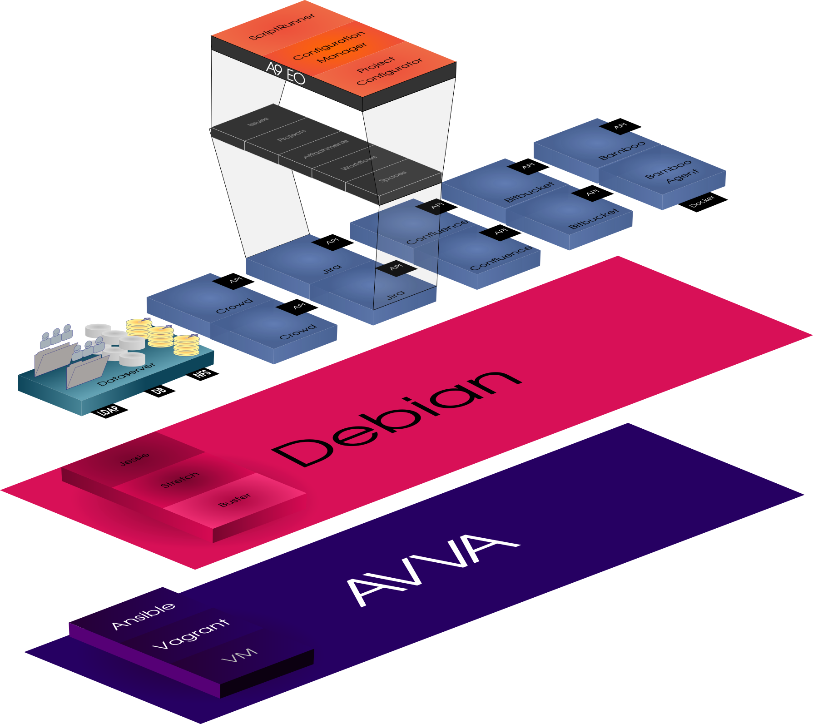

# Avva

Ansible/Vagrant/VirtualBox/Atlassian

Spawned from Steve Smith's Ansible examples for Bitbucket and Bamboo Docker agents.

Quickly bootstrap up-to-date Atlassian tools environment for POC with VirtualBox and Vagrant.

----

# Requirements

- VirtualBox

- Vagrant from Hashicorp

- jq - it is on hand for general manipulation of JSON data as part of other projects and is used in the init.sh phase. If you do not wish to use jq, you can reference the same API call used to determine the current release version and make the change required in each of the application roles under roles/app/defaults/main.yml

- whiptail - if you want to use the launcher.sh menu interface instead of vagrant, you'll need whiptail or dialog and a s/whiptail/dialog/g

# Quick guide

Ansible configuration changes may be required for your environment. See ansible.cfg in this repo for an example file suitable for Debian Buster.

Vagrant, VirtualBox required for use as configured.

Initialize with init.sh. This will probe Atlassian Marketplace for current SW versions and set values in product roles.  Some manual editing of Vagrantfiles is necessary to set the default interface for network bridge between host and guest.  

### Check Versions & product details
    sh versions.sh

### Initialize and run with Vagrant
    sh init.sh

    ln -s product-Vagrantfile Vagrantfile
    vagrant up

or
	echo "Launching Crowd..."
	VAGRANT_VAGRANTFILE=crowd-Vagrantfile vagrant up 

	echo "Launching Confluence..."
	VAGRANT_VAGRANTFILE=confluence-Vagrantfile vagrant up 

	echo "Launching Bitbucket..."
	VAGRANT_VAGRANTFILE=bitbucket-Vagrantfile vagrant up 

	echo "Launching Bamboo..."
	VAGRANT_VAGRANTFILE=bamboo-Vagrantfile vagrant up  

	echo "Launching Fisheye/Crucible..."
	VAGRANT_VAGRANTFILE=fisheye-Vagrantfile vagrant up 

	echo "Launching Jira"
	VAGRANT_VAGRANTFILE=jiracore-Vagrantfile vagrant up 

Rinse, repeat to upgrade.

Jinja2 template files for database creation, systemd unit files and application properties can be found in the template directory of each role.

Network interface is defined in each product's Vagrantfile and must be edited for your environment (at the moment).

Edit & run boot.sh for serial launch or quicklaunch.sh (WIP) to bootstrap products in parallel. i7 with 12GB+ of memory is recommended.

**quicklaunch.sh** will launch all product VMs in the background. Comment out the products you don't wish to run and execute this script if your goal is to launch products without interaction or resource constraints.

## Process

Vagrantfiles for each application are present.

The vagrantfiles specify 'ansible' for VM deployment and service provisioning.

Vagrant calls the provider as defined. The libvirt branch contains a standalone PoC of Jira using libvirt API to use KVM, Xen or qemu.

### Debian

Debian is used as the Base OS for Avva. It's trivial to change to a Ubuntu release like Xenial or Zesty, if you like. Some differences may require subsequent edits.

The Debian base environment is specified in roles/debian-common and debian-systemd. These are applied to all VMs built with Avva, regardless of application.

### Ansible

Ansible is used to prepare the base OS environment, unpack the application tarballs, create users, set permissions and so forth.

The Jinja2 service templates for the applications are within each product directory.

Roles are templated in role_templates, and variables for product version are set and replaced within these.

Upon running init.sh, the role_templates directory is copied to "roles" and variable placeholders replaced with current product versions for all products.

### Ansible Workflow

- Run init.sh

- Verify Vagrant files are correct

- Validate roles/product/defaults/main.yml and roles/product/tasks/main.yml for your scenario

- Make changes to roles/\* files as required

- On the host machine: re-run 'vagrant provision' or the ansible command string printed by Vagrant

- On the guest: the /vagrant directory contains the active files used by Ansible to configure the host and plays can be executed directly on the guest. Validate the changes required manually to achieve the desired functionality. Use rsync, scp or manually duplicate the edits in the roles directory on the host and re-run 'vagrant provision'.

- Changes made directly to roles/tasks/ do not need correction after copying to role_templates. Files under roles/defaults/ have been modified with product versions and variable placeholders must be restored for subsequent initialization or update tasks to function correctly.

### Applications

Jira Software is installed as the default. Other product tarballs can be substituted in roles/jira/defaults/main.yml

Crowd is installed along with OpenDJ for LDAP server access and utilities for modeling user directory structure hierarchies

Confluence is installed 

Many current application versions offer Data Center deployment as an option enabled by license file. A Data Center version of AVVA is planned, meanwhile, however it is theoretically possible to clone VM images once installed, using a shared/network storage solution for application data (confluence_home for example) to create an application cluster for evaluation.

## Boot.sh

It's possible to use multi-machine in a custom file to bring a combination of apps online.

VMs require VirtualBox, and allocate a desperately low 1024MB per machine. Raise this for best results.

Run versions.sh to find the most recent Atlassian product version and set in roles/product/defaults/main.yml

The **boot.sh** script can be modified to suit your circumstances to launch Confluence, JIRA, Bitbucket, FeCru, Bamboo and an Agent, or just a single app.

## Product versions in this repo:

Versions are set in the main.yml file under the role/default directory for each app.

For example, **roles/crowd/defaults/main.yml**

    ---
    
    crowd_user: crowd
    
    crowd_version: "3.1.1"
    
    crowd_dir: "atlassian-crowd-{{crowd_version}}"
    crowd_tar: "atlassian-crowd-{{crowd_version}}.tar.gz"
    
    crowd_base: "/opt/atlassian/crowd"
    crowd_home: "/var/atlassian/crowd"
    
    crowd_db_host: localhost
    crowd_db: crowd
    crowd_db_user: crowd
    crowd_db_passwd: crowd
    
    crowd_setup: false
    
    crowd_admin_user: admin`
     

---

## To do

There is now a [Public Trello Board](https://trello.com/b/8VbF9UUG/avva) for this project.

- Postgres is currently installed to each VM to serve the application locally, meaning JIRA Service Desk has a database available and known only to that host.  Ideally, there's some sort of [HA](https://bitbucket.org/wkennedy/atlas-playground) for Postgres. I may port over what I have - we'll see. It would work for Java apps and shared storage - just sayin'..

- Yaml files need pruning and adjustment.

- I'd like to see automatic updates of playbooks at least. APIs are known. Need Jenkins or Bamboo with a task to poll Marketplace and do a search and replace, dry-run, commit and push. See [versions.sh](https://bitbucket.org/wkennedy/atlassian-versions).

----
## ./meta/main.yml

	---
	dependencies:
	  - { role: java-common }
----
## ./defaults/main.yml

---

	confluence_user: confluence

	confluence_version: "6.7.1"

	confluence_dir: "atlassian-confluence-{{confluence_version}}"
	confluence_tar: "atlassian-confluence-{{confluence_version}}.tar.gz"

	confluence_base: "/opt/atlassian/confluence"
	confluence_home: "/var/atlassian/confluence"

	confluence_db_host: localhost
	confluence_db: confluence
	confluence_db_user: confluence
	confluence_db_passwd: confluence

	confluence_setup: false

	confluence_admin_user: admin
----
## ./tasks/main.yml

	---
	- hostname:
	    name: confluence

	- name: Install Confluence dependencies
	  apt: pkg=git,curl state=installed

	- name: Create base directory
	  file: path={{confluence_base}} state=directory

	- name: Fetch Confluence
	  get_url: 
	    url=https://www.atlassian.com/software/confluence/downloads/binary/{{confluence_tar}}
	    dest={{confluence_base}}/{{confluence_tar}}

	- name: Unpack Confluence
	  command: 
	    creates={{confluence_dir}}
	    chdir={{confluence_base}}
	    tar xzf {{confluence_tar}}

	- name: Create user
	  user: 
	    name={{confluence_user}}
	    home={{confluence_home}}
	    createhome=true

	- name: Fix permissions for working directories
	  file: path={{confluence_base}}/{{confluence_dir}}/{{item}} owner={{confluence_user}} state=directory recurse=true
	  with_items:
	    - logs
	    - temp
	    - work

	- name: Create config directory
	  file: path={{confluence_home}}/shared/ state=directory owner={{confluence_user}}

	- name: Install default config
	  #template: src="confluence-config.properties.j2" dest="{{confluence_home}}/shared/confluence-config.properties"
	  template: src="confluence-init.properties.j2" dest="/opt/confluence/{{confluence_dir}}/confluence/WEB-INF/classes/confluence-init.properties"

	- name: Symlink install to current
	  command:
	    chdir={{confluence_base}}
	    ln -sf {{confluence_dir}} current

	- name: Install systemd unit
	  template:
	    src=confluence.service.j2
	    dest=/etc/systemd/system/confluence.service
	  register: svc

	- name: Enable
	  shell: systemctl daemon-reload ; systemctl enable confluence.service

	- name: Start Confluence
	  shell: sudo service confluence start

	- name: Install Confluence license
	  command: >
	     curl -H 'Content-Type: application/json' \
		  --data '{"license":"{{confluence_license}}" }' \
		  --user admin:admin \
		  'http://localhost:8090/rest/api/1.0/admin/license'
	  when: confluence_setup

	- name: Create Admin user
	  command: >
	     curl -H 'Content-Type: application/json' --data '' \
		  --user admin:admin \
		  'http://localhost:8090/rest/api/1.0/admin/users?name={{confluence_admin_user}}&password={{confluence_admin_passwd}}&displayName=AdminUser&emailAddress=root@localhost'
	  when: confluence_setup

	- name: Set Admin user permissions
	  command: >
	     curl -H 'Content-Type: application/json' --data '' \
		  --user admin:admin \
		  --request PUT \
		  'http://localhost:8090/rest/api/1.0/admin/permissions/users?permission=SYS_ADMIN&name={{confluence_admin_user}}'
	  when: confluence_setup
----

## ./handlers/main.yml

	---

	- name: reload_units
	  command: systemctl daemon-reload
	  ignore_errors: true

	- name: enable_confluence
	  command: systemctl enable confluence.service

	- name: restart_confluence
	  command: systemctl restart confluence.service
	  # Will fail if we do this before the systemd is booted into systemd
	  ignore_errors: true

----

# Modifications and Troubleshooting

## Ansible tasks

Modify tasks in the roles/ directory and rerun 'vagrant provision' on the product being modified.

When satisfied with the changes made in the target VM, copy the YAML file from roles/ into the appropriate role_templates/ (sub)directory and commit. Submit PR and be prepared to wait :) this is not a high-priority project for me at the moment.

Changing the VAGRANTFILE variable should be sufficient to re-provision the instance according to the role, as set in the vagrantfile.

## Reporting bugs

There is a Trello board associated with this project: https://trello.com/b/8VbF9UUG/avva

