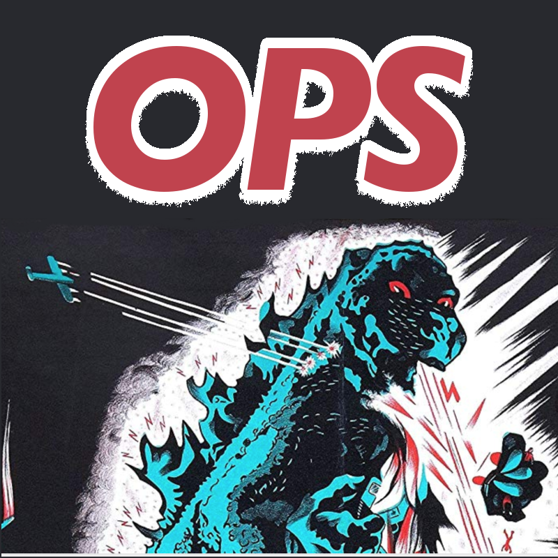

# Atlassian Ops

## An open collection of best practices, boilerplate documentation, templates and other resources developed and contributed by members of the Atlassian Community

## Requirements

Requirements vary by component and should be documented within the directory.

## Get Started

- (Shallow) clone this repo:

    `git clone  https://bitbucket.org/wkennedy/atlassianops --recurse-submodules
`
If it's been a while:

    `git pull`

- Update submodules

    git submodule update

## Submissions

- Clone this repository

- Commit your additions

- Submit a [Pull Request](https://www.atlassian.com/git/tutorials/making-a-pull-request)

# Tools

Command line and other interfaces

- [Super productivity](https://github.com/johannesjo/super-productivity) Free to do list & time tracker for programmers & designers with Jira integration http://super-productivity.com
)
- [Go-jira](https://github.com/go-jira/jira) simple jira command line client in Go

# Scripting Languages and Tools
- [groovy console](https://bitbucket.org/fhess/groovy-script-console/src/master/) - This add-on provides a groovy script console for Atlassian products

# Libraries
- jira: Python JIRA Library is the easiest way to automate JIRA

# System and Application Inventory Tools

- [atlassian-addons-audit-sheet](https://github.com/google/atlassian-addons-audit-sheet) - This tool will synchronize the list of Enabled User-Installed plugins in JIRA, Confluence, and Bitbucket with a Google Sheet for documentation and auditing.

# System Tools
- [Atlas Authority One Offs](https://bitbucket.org/atlasauthority/one-offs/) - JS & Python scripts because you don't get SQL in Cloud.
